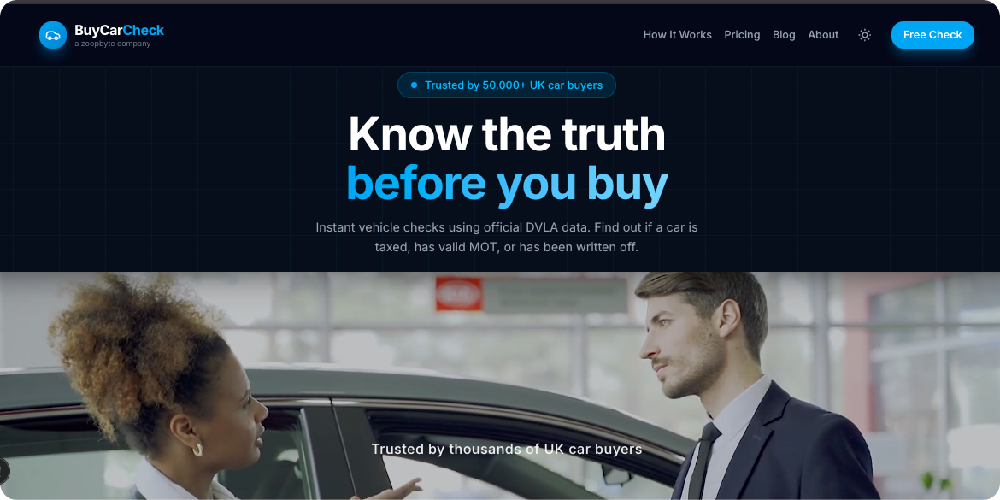

<div align="center">
  
  <p><strong>Full-Stack UK Vehicle History SaaS</strong> — live at <a href="https://buycarcheck.com">buycarcheck.com</a></p>
  <p>
    
    
    
    
    
    
    
  </p>
</div>

---

> ## ⚠️ Public Showcase — Proprietary Source Code is Private
>
> This repository is an **intentionally limited public showcase** of [buycarcheck.com](https://buycarcheck.com).
>
> The full production codebase is **privately held** to protect proprietary business logic, government API credentials, payment infrastructure, and operational security tooling.
>
> What you'll find here: this README, TypeScript type definitions, Zod validation schemas, representative API route handlers, and a Jest test suite — enough to demonstrate architecture, engineering approach, and production code quality.
>
> **To view the live product: [buycarcheck.com](https://buycarcheck.com)**

---



---

## What is BuyCarCheck?

BuyCarCheck is a production SaaS product built for the UK used car market. A buyer enters any UK number plate and receives an instant vehicle history report — combining real-time government data with third-party insurance, finance, and police databases.

The product solves a real problem: every year thousands of UK buyers unknowingly purchase written-off, stolen, or finance-encumbered vehicles. BuyCarCheck surfaces this information in seconds, before money changes hands.

**Live product · paying customers · real government API integrations · fully serverless.**

## Competitive Landscape

The established players — **HPI Check**, **Motorway**, and **AutoTrader** — dominate on brand recognition but carry the weight of legacy infrastructure: cluttered interfaces, dated UX, and astronomical pricing (£19.99) that hasn't moved in years. BuyCarCheck's moat is straightforward: a cleaner, faster, and more accessible product at a significantly lower price point, built from the gorund up with modern tooling (React/Next.js/Tailwind), as well as some key proprietary logic and tech. 

More than just a car check service, our vehicle reports and blog posts humanise the car-buying experience in a way the incumbents can't compete with. This entire project afterall, is based on the founder's own personal experience. 

---

## Product Tiers

| Tier | Price | What's included |
|---|---|---|
| **Free Check** | £0 | Make, model, colour, engine, fuel type, CO₂, tax status, MOT status, V5C date, ULEZ/Congestion Charge eligibility, VED band, fuel running cost estimate |
| **1 Full Check** | £4.99 | Everything in Free + full write-off history (Cat A/B/S/N via **MIAFTR / ABI insurance database**), outstanding finance check (**Experian / HPI**), stolen vehicle check (**Police National Computer**), full MOT history with advisories, keeper history, plate change history, vehicle valuation, full factory specification & trim level |
| **2 Full Checks** | £8.99 | 2× Full Check credits — £4.50/report, save 10%, use anytime |
| **3 Full Checks** | £11.99 | 3× Full Check credits — £4.00/report, save 20%, credits never expire |

---

## Technical Highlights

### Serverless Architecture
Built entirely on the **Vercel serverless platform** — zero infrastructure management, global edge network, automatic scaling. Every API route is an independently deployed serverless function with no shared state between invocations. A custom **edge middleware layer** intercepts every request before it reaches any route handler — handling maintenance mode (instant toggle via environment variable, no redeploy), locale-based routing, admin bypass, bot detection, and front-door access control.

### Multi-Layer Rate Limiting
Rate limiting backed by **Redis on AWS** — a low-latency, serverless-compatible key-value store. Unlike in-process Maps (which reset on every cold start and are meaningless on a stateless platform), Redis counters persist across all function instances and regions, enforcing limits that actually work at scale. Sliding window algorithm per IP, fail-open on Redis unavailability so the site never goes down due to the rate limiter.

### Payment Infrastructure
Full **Stripe Checkout** integration — hosted payment page, webhook signature verification, idempotent credit creation, and a race condition-safe **optimistic locking** mechanism on credit consumption. Concurrent payment attempts for the same session are blocked at the database layer, not application layer. Session IDs are scrubbed from browser history immediately after processing.

### Security
- Origin validation on all public POST endpoints — exact header matching, path-delimited referer verification, zero spoofing
- GDPR-compliant IP anonymisation via nightly scheduled cron
- Serverless-safe rate limiting via Redis (per-IP, sliding window, cross-instance)
- Front-door proxy guard for direct URL access — social share links use a signed bypass parameter
- Stripe webhook signature verification on every inbound event


### Data Integrations
| Source                                  | What it provides | Auth method |
|-----------------------------------------|---|---|
| **DVLA Vehicle Enquiry API**            | Tax, MOT, registration, make/model | API key |
| **DVSA MOT History API**                | Full MOT records, advisories, mileage | Azure AD OAuth2 (client credentials, server-side token cache) |
| **B2B Licensed Vehicle Data Providers** | Write-off (MIAFTR/ABI), finance (Experian/HPI), stolen (PNC), keeper history, full spec | API key, proprietary integration |

### Analytics & Observability
- **Google Analytics 4** — full event tracking including `purchase` events with accurate transaction values per tier
- **Google Ads conversion tracking** — conversion events with real revenue values, transaction ID deduplication
- UTM parameter capture and attribution through to purchase
- Custom internal analytics dashboard (private route) — visit trends, conversion funnel, per-plate activity log, profit/margin per check

---

## Tech Stack

| Layer | Technology |
|---|---|
| Framework | Next.js (App Router, serverless) |
| Language | TypeScript (strict) |
| Styling | Tailwind CSS |
| Database | PostgreSQL (private schema, service-role server-side access only) |
| Rate Limiting | Upstash Redis on AWS (`@upstash/ratelimit`, sliding window) |
| Payments | Stripe Checkout + Webhooks |
| Email | Transactional email provider (post-purchase receipts) |
| Validation | Zod (all API entry points) |
| Testing | Jest + Testing Library |
| Deployment | Vercel (serverless, global CDN) |
| Analytics | Google Analytics 4 + Google Ads |

---

## UX & Accessibility

- **Frictionless mobile-first design** — the primary user is standing in a car park or at a dealership. The plate input, free check, and purchase flow are optimised for one-handed use on a phone in any lighting condition
- **WCAG 2.1 AA compliant** — full accessibility pass: colour contrast ratios (4.5:1+ on all text), `aria-label` on all interactive elements, `aria-hidden` on all decorative SVGs, visible focus rings on every interactive control, form field labels, video pause control for auto-playing media
- **Responsive across all breakpoints** — dedicated mobile layout with large touch targets, left-aligned plate font, prominent standalone CTA button; desktop layout uses a joined pill-style form
- **Light mode default** — optimised for outdoor readability; user preference persisted to localStorage
- **Post-purchase actions** — Print / Save PDF / Share on WhatsApp (with OG image preview and correct accessible contrast on WhatsApp green)
- **10 language locales** — full i18n via Next.js App Router locale segments: 🇬🇧 English · 🇩🇪 German · 🇪🇸 Spanish · 🇫🇷 French · 🇮🇹 Italian · 🇵🇱 Polish · 🇸🇦 Arabic (RTL) · 🇷🇺 Russian · 🇨🇳 Chinese · 🇯🇵 Japanese — UI copy, hero text, and blog routes all locale-aware with persistent language preference via cookie

---

## Content & SEO

- **Blog** — 8 long-form articles targeting UK car buying search terms (Cat S vs Cat N, MOT checks, finance checks, used car buying guides, fuel economy)
- **Structured data** — JSON-LD `WebSite`, `FAQPage`, `Product` schema for Google rich results
- **Dynamic sitemap + robots.txt**
- **Open Graph + Twitter Card** — branded OG image (1200×630) served from CDN for rich link previews in WhatsApp, iMessage, Twitter

---

## Project Structure

```
src/
├── app/
│   ├── api/
│   │   ├── basiccheck-dv/     # Free check — DVLA + DVSA, Redis rate-limited
│   │   ├── free-checker/      # Background analytics logger, Redis rate-limited
│   │   ├── fullcheck-paid/    # Paid check — Stripe gate + optimistic credit lock
│   │   ├── credits/redeem/    # Credit redemption by email
│   │   ├── checkout/          # Stripe session creation
│   │   ├── webhooks/stripe/   # Webhook handler (signature-verified)
│   │   ├── img/[vrm]/         # Vehicle image proxy
│   │   ├── ping/              # Visitor event + health check
│   │   └── cron/              # Scheduled GDPR IP anonymisation
│   ├── blog/                  # 8 SEO articles
│   ├── contact/
│   ├── sample-report/         # Live example report
│   └── [locale]/              # i18n: EN/DE/ES/FR/IT/PL/AR/RU/ZH/JA
├── components/
│   ├── vehicle/
│   │   ├── VehicleCheckForm.tsx   # UK plate input, recent search history, clear button
│   │   ├── VehicleReport.tsx      # Full report rendering
│   │   └── sections/              # MOT history, financials, spec grid, running costs
│   ├── home/                      # Hero, pricing cards, stats counter, video carousel
│   └── layout/                    # Header (i18n, dark mode, language picker)
├── lib/
│   ├── DataProviderSwitch.ts      # Provider abstraction layer, multi-source data fetching
│   ├── ratelimit.ts               # Upstash Redis rate limiters
│   ├── ved.ts                     # UK VED band calculator (13 CO₂ bands, pre/post-2017)
│   ├── provider.ts                # Licensed data provider parser → FullHistoryData
│   └── validators/                # Zod schemas
├── types/
│   └── VehicleSpecifications.ts   # FullHistoryData, BasicVehicleInfo, all core types
├── proxy.ts                       # Edge: maintenance mode, rate limiting, origin guard
└── __tests__/                     # Jest suite
```

---

## Tests

```bash
npm test
```

```
PASS src/__tests__/vehicle-validator.test.ts
  registrationSchema
    ✓ accepts a standard current-format plate
    ✓ strips spaces and uppercases input
    ✓ accepts a personalised plate
    ✓ rejects a single character
    ✓ rejects a plate over 8 characters
    ✓ rejects an empty string

PASS src/__tests__/mock-data.test.ts
  getMockData
    ✓ returns the registration that was passed in
    ✓ returns numeric engine capacity
    ✓ returns a valid tax status string
    ✓ returns a valid MOT status string
    ✓ returns a year within a plausible range
```

---

## Running Locally

```bash
git clone https://github.com/TechAngelX/BuyCarCheck-Demo.git
cd BuyCarCheck-Demo
npm install
npm run dev
```

Without API keys the app runs entirely on deterministic mock data — no credentials needed to explore the UI and component architecture.

---

## Environment Variables (production)

```env
# Government APIs
DVLA_API_KEY=
DVSA_CLIENT_ID=
DVSA_CLIENT_SECRET=
DVSA_TENANT_ID=

# Licensed data provider
PROVIDER_API_KEY=
PROVIDER_TEST_API_KEY=

# Payments
STRIPE_SECRET_KEY=
STRIPE_WEBHOOK_SECRET=
NEXT_PUBLIC_STRIPE_PUBLISHABLE_KEY=

# PostgreSQL
NEXT_PUBLIC_DB_URL=
DB_SERVICE_KEY=

# Redis rate limiting (Upstash / AWS)
UPSTASH_REDIS_REST_URL=
UPSTASH_REDIS_REST_TOKEN=

# Email
EMAIL_API_KEY=

# Analytics
NEXT_PUBLIC_GA_ID=
NEXT_PUBLIC_AW_ID=
NEXT_PUBLIC_AW_CONVERSION_LABEL=
```

---

<div align="center">
  <br />
  <a href="https://techangelx.com" target="_blank" rel="noopener noreferrer">
    
  </a>
  <br /><br />
  <strong>Built by Ricki Angel</strong> · <a href="https://techangelx.com">Tech Angel X</a>
  <br />
  <sub>© 2026 <a href="https://zoopbyte.com">Zoopbyte</a> · Proprietary · All rights reserved</sub>
</div>
