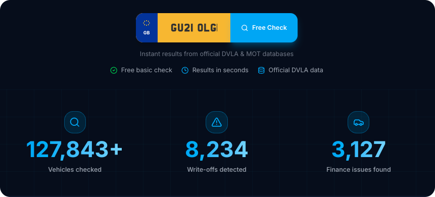
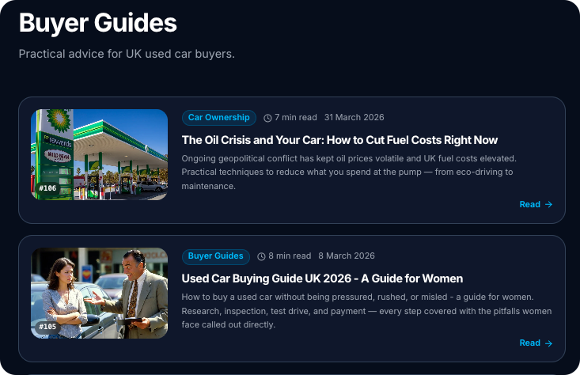
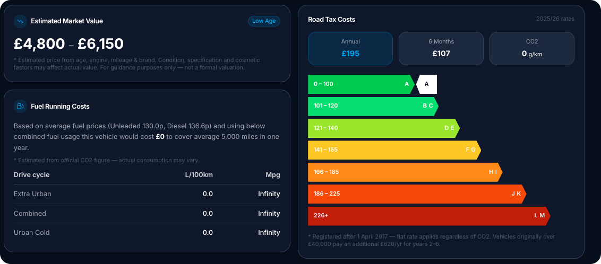
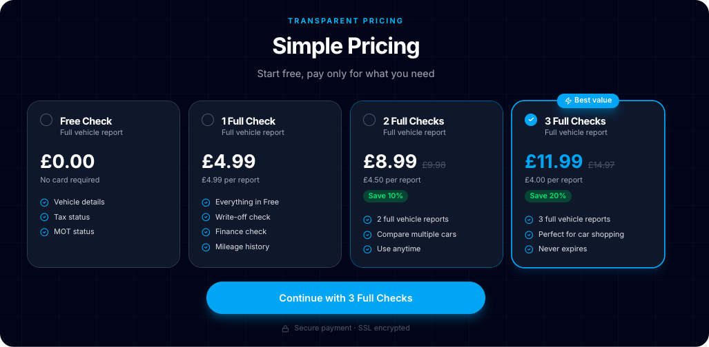

<div align="center">
  
  <h1>BuyCarCheck</h1>
  <p><strong>UK Vehicle History Checker</strong> — live at <a href="https://buycarcheck.com">buycarcheck.com</a></p>
</div>

---

> ## ⚠️ Public Showcase — Proprietary Source Code is Private
>
> This repository is a **intentionally limited public showcase** of [buycarcheck.com](https://buycarcheck.com).
>
> The full production codebase is **privately held** to protect:
> - Government API credentials (DVLA, DVSA)
> - Payment processing logic (Stripe)
> - Proprietary business logic and admin infrastructure
> - Internal analytics and operational tooling
>
> What you'll find here: the README, TypeScript type definitions, a Zod validation schema, a representative API route, and a test suite — enough to demonstrate architecture, code style, and engineering approach.
>
> **To view the live product, visit [buycarcheck.com](https://buycarcheck.com).**

---




## What is BuyCarCheck?

BuyCarCheck is a full-stack SaaS product built for the UK used car market. A buyer enters any UK number plate and receives an instant vehicle history report — pulled in real time from official government data sources.

The service helps buyers avoid purchasing written-off, uninsured, or incorrectly advertised vehicles before handing over money.

## Features

- **Free Basic Check** — Make, model, colour, engine size, fuel type, CO2 emissions, tax status, MOT status, V5C date
- **Paid Full Check (£4.99)** — Write-off category (Cat S / Cat N), outstanding finance, mileage history, plate change history
- MOT history with pass/fail records, advisories, failure reasons, and mileage progression
- VED (road tax) band calculator — CO2-based, with separate pre/post-2017 logic
- Fuel efficiency estimator (MPG, L/100km, annual cost)

## User Engagement

- SEO-optimised blog articles targeting UK car buying search terms
- Structured data (JSON-LD) for Google rich results
- Dynamic sitemap + robots.txt



## Detailed Vehicle Statistics

- CO2 band lookup across all 13 UK VED bands (A–M)
- Estimated annual and 6-month road tax cost
- Pre/post-2017 registration split (different tax rules apply by law)



## Pricing & Conversion

- Tiered free/paid model
- Customer reviews section
- Animated stats counters



---

## Tech Stack

| Layer | Technology |
|---|---|
| Framework | Next.js 16 (App Router) |
| Language | TypeScript |
| Styling | Tailwind CSS 4 |
| UI Components | Radix UI + shadcn/ui |
| State | Zustand |
| Data Fetching | TanStack React Query |
| Validation | Zod |
| Database | Supabase (PostgreSQL) |
| Payments | Stripe |
| Testing | Jest + Testing Library |
| Deployment | Vercel |

## REST API & Cloud Service Integrations

- **DVLA Vehicle Enquiry REST API** — real-time tax, MOT and registration data from the UK government cloud
- **DVSA MOT History REST API** — full MOT test history, authenticated via Azure AD OAuth2 client credentials flow with server-side token caching
- **Stripe** — cloud payment processing for full report purchases
- **Supabase** — managed PostgreSQL cloud database for analytics, accessed via REST and the Supabase JS client
- **Write-off data provider** — Cat S/N check (third-party REST API integration in progress)

## Architecture Highlights

- **REST API routes** — Next.js App Router API handlers expose typed POST endpoints consumed by the frontend, with Zod validation at every entry point
- **Server Components by default** — all data-fetching pages are server-rendered for SEO and TTFB
- **Cloud service integrations** — DVLA and DVSA are UK government cloud REST APIs; Stripe and Supabase are third-party cloud platforms, all integrated via server-side service calls
- **Middleware** — Next.js middleware intercepts every request for bot detection, unknown path logging, and rate limiting before it reaches any route handler
- **PostgreSQL database** — Supabase-hosted Postgres stores visitor analytics in a private schema; all writes use the service role key server-side, never exposed to the client
- **OAuth2 token caching** — DVSA Azure AD tokens cached in-memory with auto-refresh on 401 — no redundant auth round-trips
- **Graceful mock fallback** — runs fully without API credentials using deterministic seeded mock data
- **Privacy-first analytics** — custom visitor tracking with no cookies, no IP storage, backed by Supabase

## Project Structure

```
src/
├── app/
│   ├── api/
│   │   └── check/
│   │       ├── basic/          # Free DVLA vehicle check
│   │       ├── mot-history/    # DVSA MOT history (OAuth2)
│   │       └── writeoff/       # Paid write-off check
│   ├── blog/                   # 7 static SEO articles
│   ├── sample-report/          # Example report page
│   ├── layout.tsx
│   └── page.tsx
├── components/
│   ├── vehicle/
│   │   ├── VehicleCheckForm.tsx  # UK plate input with search history
│   │   └── VehicleReport.tsx     # Full report — MOT, tax, VED, write-off
│   ├── home/                     # Hero, pricing, reviews, stats
│   └── ui/                       # shadcn/ui base components
├── lib/
│   ├── ved.ts                    # UK road tax band calculator (13 CO2 bands)
│   └── validators/               # Zod schemas
├── types/
│   └── vehicle.ts                # TypeScript interfaces
└── __tests__/                    # Jest test suite
```

## Tests

```bash
npm test
```

```
PASS src/__tests__/vehicle-validator.test.ts
  registrationSchema
    ✓ accepts a standard current-format plate
    ✓ strips spaces and uppercases input
    ✓ accepts a personalised plate
    ✓ rejects a single character
    ✓ rejects a plate over 8 characters
    ✓ rejects an empty string

PASS src/__tests__/mock-data.test.ts
  getMockData
    ✓ returns the registration that was passed in
    ✓ returns numeric engine capacity
    ✓ returns a valid tax status string
    ✓ returns a valid MOT status string
    ✓ returns a year within a plausible range
```

## Running Locally

```bash
git clone https://github.com/TechAngelX/BuyCarCheck-Demo.git
cd BuyCarCheck-Demo
npm install
npm run dev
```

Without API keys the app runs entirely on mock data — no credentials needed to explore the UI.

## Environment Variables

```env
# Government APIs
DVLA_API_KEY=your_key
DVSA_CLIENT_ID=your_client_id
DVSA_CLIENT_SECRET=your_client_secret

# Payments
STRIPE_SECRET_KEY=sk_...
NEXT_PUBLIC_STRIPE_PUBLISHABLE_KEY=pk_...

# Database
NEXT_PUBLIC_SUPABASE_URL=https://...
SUPABASE_SERVICE_ROLE_KEY=...
```

---

***

<div align="center">
  <br />
  <a href="https://techangelx.com" target="_blank" rel="noopener noreferrer">
    
  </a>
  <br /><br />
  <strong>Built by Ricki Angel</strong> · <a href="https://techangelx.com">Tech Angel X</a>
  <br />
  <sub>© 2026 · Proprietary · All rights reserved</sub>
</div>
